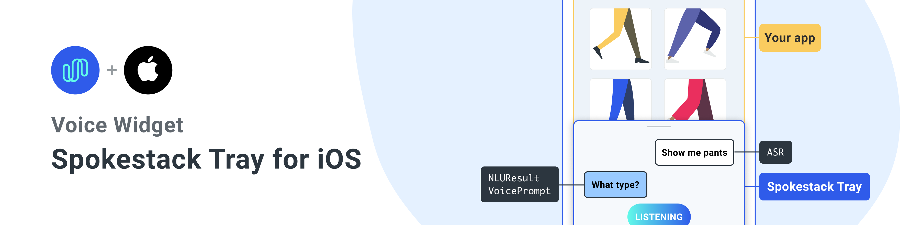

<a href="https://www.spokestack.io/blog/integrating-spokestack-in-ios" title="Integrating Spokestack in iOS"></a>

A native iOS library for adding Spokestack to any iOS app.


## Installation

### Edit Podfile

[](https://cocoapods.org/pods/SpokestackTray-iOS)

[CocoaPods](https://cocoapods.org) is a dependency manager for Cocoa projects. For usage and installation instructions, visit their website. To integrate Spokestack into your Xcode project using CocoaPods, specify it in your Podfile:

`pod 'SpokestackTray-iOS'`

### Edit Info.plist

Add the following to your Info.plist to enable permissions. Also ensure your iOS deployment target is set to 13.0.

_Without these your app will crash_

```
  <key>NSMicrophoneUsageDescription</key>
  <string>For making voice requests</string>
  <key>NSSpeechRecognitionUsageDescription</key>
  <string>For understanding your voice requests</string>
```

### Set the AudioSession category

 _For most apps, this should be put in AppDelegate.application_

```swift
        do {
            let session = AVAudioSession.sharedInstance()
            try? session.setCategory(.playAndRecord, options: [.defaultToSpeaker, .allowAirPlay, .allowBluetoothA2DP, .allowBluetooth])
            try? session.setActive(true, options: [])
        }
```

## Usage

```swift
import SpokestackTray
import Spokestack

    override func viewDidLoad() {
        
        super.viewDidLoad()
        self.view.backgroundColor = .green
        
        /// Child view controller
        
        self.addHostingController()

        let configuration: TrayConfiguration = TrayConfiguration()
        
        /// When the tray is opened for the first time this is the synthesized
        /// greeting that will be "said" to the user

        configuration.greeting = """
        Welcome! This example uses models for Minecraft. Try saying, \"How do I make a castle?\"
        """
        
        /// When the tray is listening or processing speech there is a animated gradient that
        /// sits on top of the tray. The default values are red, white and blue

        configuration.gradientColors = [
            "#61fae9".spstk_color,
            "#2F5BEA".spstk_color,
            UIColor.systemRed
        ]

        /// Apart of the initialization of the tray is to download the nlu and wakeword models.
        /// These are the default Spokestack models, but you can replace with your own

        configuration.nluModelURLs = [
            NLUModelURLMetaDataKey: "https://d3dmqd7cy685il.cloudfront.net/nlu/production/shared/XtASJqxkO6UwefOzia-he2gnIMcBnR2UCF-VyaIy-OI/nlu.tflite",
            NLUModelURLNLUKey: "https://d3dmqd7cy685il.cloudfront.net/nlu/production/shared/XtASJqxkO6UwefOzia-he2gnIMcBnR2UCF-VyaIy-OI/vocab.txt",
            NLUModelURLVocabKey: "https://d3dmqd7cy685il.cloudfront.net/nlu/production/shared/XtASJqxkO6UwefOzia-he2gnIMcBnR2UCF-VyaIy-OI/metadata.json"
        ]
        configuration.wakewordModelURLs = [
            WakeWordModelDetectKey: "https://d3dmqd7cy685il.cloudfront.net/model/wake/spokestack/detect.tflite",
            WakeWordModelEncodeKey: "https://d3dmqd7cy685il.cloudfront.net/model/wake/spokestack/encode.tflite",
            WakeWordModelFilterKey: "https://d3dmqd7cy685il.cloudfront.net/model/wake/spokestack/filter.tflite"
        ]

        configuration.cliendId = "YOUR_CLIENT_ID"
        configuration.clientSecret = "YOUR_CLIENT_SECRET"
        
        /// The handleIntent callback is how the SpeechController and the TrayViewModel know if 
        /// NLUResult should be processed and what text should be added to the tableView.

        let greeting: IntentResult = IntentResult(node: InterntResultNode.greeting.rawValue, prompt: configuration.greeting)
        var lastNode: IntentResult = greeting

        configuration.handleIntent = {intent, slots, utterance in

            switch intent {
                case IntentResultAmazonType.repeat.rawValue:
                    return lastNode
                case IntentResultAmazonType.yes.rawValue:
                    lastNode = IntentResult(node: InterntResultNode.search.rawValue, prompt: "I heard you say yes! What would you like to make?")
                case IntentResultAmazonType.no.rawValue:
                    lastNode = IntentResult(node: InterntResultNode.exit.rawValue, prompt: "I heard you say no. Goodbye")
                case IntentResultAmazonType.stop.rawValue,
                     IntentResultAmazonType.cancel.rawValue,
                     IntentResultAmazonType.fallback.rawValue:
                    lastNode = IntentResult(node: InterntResultNode.exit.rawValue, prompt: "Goodbye!")
                case IntentResultAmazonType.recipe.rawValue:
                    
                    if let whatToMakeSlot: Dictionary<String, Slot> = slots,
                       let slot: Slot = whatToMakeSlot["Item"],
                       let item: String = slot.value as? String {
                    
                        lastNode = IntentResult(node: InterntResultNode.recipe.rawValue,
                                                prompt: """
                                                If I were a real app, I would show a screen now on how to make a \(item). Want to continue?
                                                """
                                    )
                    }
                    
                case IntentResultAmazonType.help.rawValue:
                    lastNode = greeting
                default:
                    lastNode = greeting
            }
            
            return lastNode
        }
        
        /// Which NLUNodes should trigger the tray to close automatically

        configuration.exitNodes = [
            InterntResultNode.exit.rawValue
        ]
        
        /// Callback when the tray is opened. The call back is called _after_ the animation has finished
        
        configuration.onOpen = {
            LogController.shared.log("isOpen")
        }
        
        /// Callback when the tray is closed. The call back is called _after_ the animation has finished
        
        configuration.onClose = {
            LogController.shared.log("onClose")
        }
        
        /// Callback when a `TrayListenerType` has occured
        
        configuration.onEvent = {event in
            LogController.shared.log("onEvent \(event)")
        }
        
        let tray: SpokestackTrayViewController = SpokestackTrayViewController(self, configuration: configuration)
        tray.addToParentView()
        tray.listen()
    }

```
## Contributing

See the [contributing guide](CONTRIBUTING.md) to learn how to contribute to the repository and the development workflow.

# Documentation

## Spokestack Functions

These public methods from the SpokestackTray library

### listen

Tell Spokestack to start listening.

This starts the speech pipeline by first checking to make sure that the NLU / Wakeword models have been downloaded and the necessary permissions have been granted before activating the pipeline.

### stopListening

Tell Spokestack to stop listening

### addToParentView

Adds the `SpokestackTrayViewController` to the parent view controller's view

### removeFromParentView
Stops the speechpipeline and removes the `SpokestackTrayViewController` from the parent view controller's view


